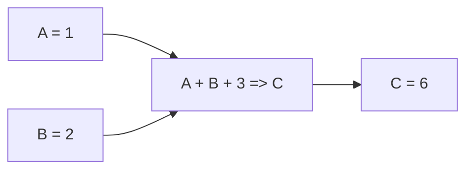
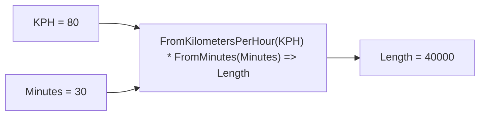

---
tags:
  - Expressions
---

# Expressions

## Overview

A logical or mathematical expression that can be evaluated in the engine.

=== "Maths expressions"

    ```
    1 + 2 => 3
    ```

=== "Logic expressions"

    ```
    10 > 6 => true
    ```

## Inputs and Outputs

Expressions are functional and can therefore depend on many input [Data Variables](./data-variables.md), but only ever produce a single output variable:

```
A + B + 3 => C
```



## Functions

Expressions can invoke a number of built in [Functions](./functions/index.md):

```
FromKilometersPerHour(KPH) * FromMinutes(Minutes) => Length
```



## Examples

??? example "Boolean Expressions"

    Perform complex logical operations:

    ```
    (A = 100 OR B > 0) AND C <= 2 => D
    ```

    ```mermaid
    graph LR
        A[A = 1] --> Expression["(A = 100 OR B > 0) AND C <= 2 => D"]
        B[B = 2] --> Expression
        C[C = 1] --> Expression
        Expression --> D[D = true]
    ```

??? example "Maths Expressions"

    Perform maths!

    ```
    A + B * (A - B) => C
    ```

    ```mermaid
    graph LR
        A[A = 1] --> Expression["A + B * (A - B) => C"]
        B[B = 2] --> Expression
        Expression --> C[C = 1]
    ```

??? example "Create a constant"

    Expressions don't have to have an input:

    ```
    22 / 7 => PI
    ```

    ```mermaid
    graph LR
        Expression["22 / 7 => PI"]
        Expression --> PI[PI = 3.14159265359]
    ```

??? example "Alias a data variable"

    Expressions can simply pass on a value to rename or alias a data variable:

    ```
    A => B
    ```

    ```mermaid
    graph LR
        A[A = 1] --> Expression["A => B"]
        Expression --> B[B = 1]
    ```

## Under the hood

EngineBay's Expression parsing is based on [Flee](https://github.com/mparlak/Flee), a lightweight and extensible expression evaluator.

To give it out the box functionality, it's been extended with the following libraries:

- [Flee](https://github.com/mparlak/Flee) - for basic logical and mathematical operators
- [UnitsNet](https://github.com/angularsen/UnitsNet) - for units of measurement and conversion functionality
- [EngineBay.SheetFunctions](../modules/sheet-functions.md) - for Excel-like functions

You can find out more about this decision in the [Expression Engine](../../about/architecture-decision-records/expression-engine.md) architecture decision record.
