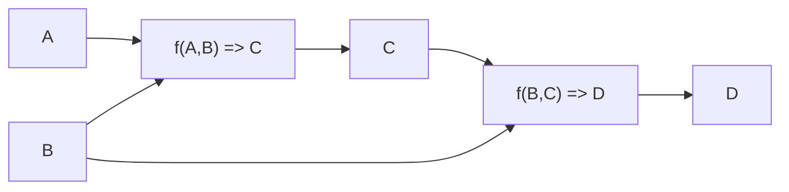
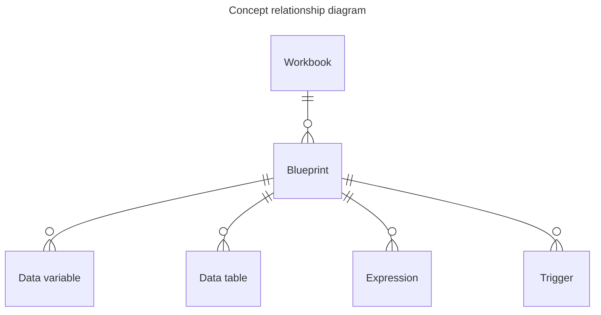

# Concepts

## Overview

There are a few of concepts in EngineBay to get familiar with when modelling a domain. You can read up more about each concept in detail, however, the gist is:

- Everything is contained in a [Workbook](./workbooks.md) as a Blueprint.
- [Blueprints](./blueprints/blueprints.md) contain Expressions, Data Variables, Data Tables, and Triggers.
- [Expressions](./expressions.md) are functions with input and output [Data Variables](./data-variables.md).
- Changes in the value of a Data Variable invokes [Triggers](./triggers.md).

## How it works

When the engine runs, the all the Blueprints in a Workbook are compiled down into a graph of functions that can be invoked on input Data Variables to produce useful outputs.

## Model

When drawn as an Entity Relationship Diagram it looks like this:

